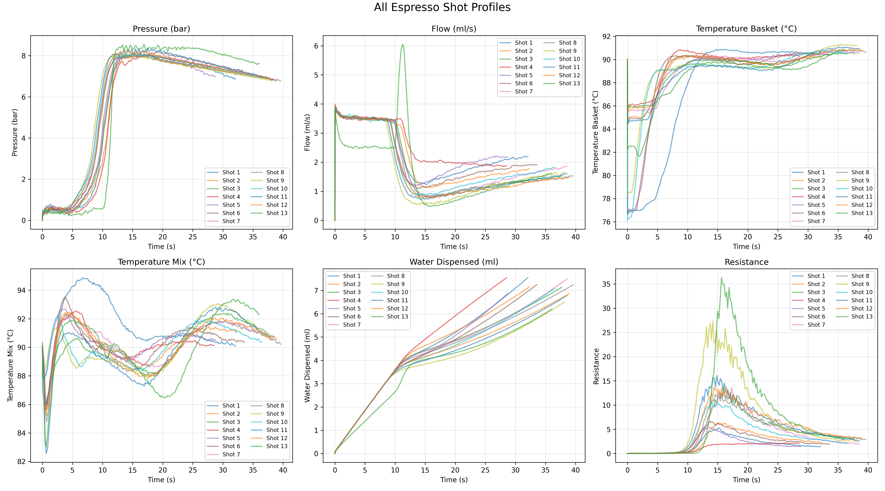
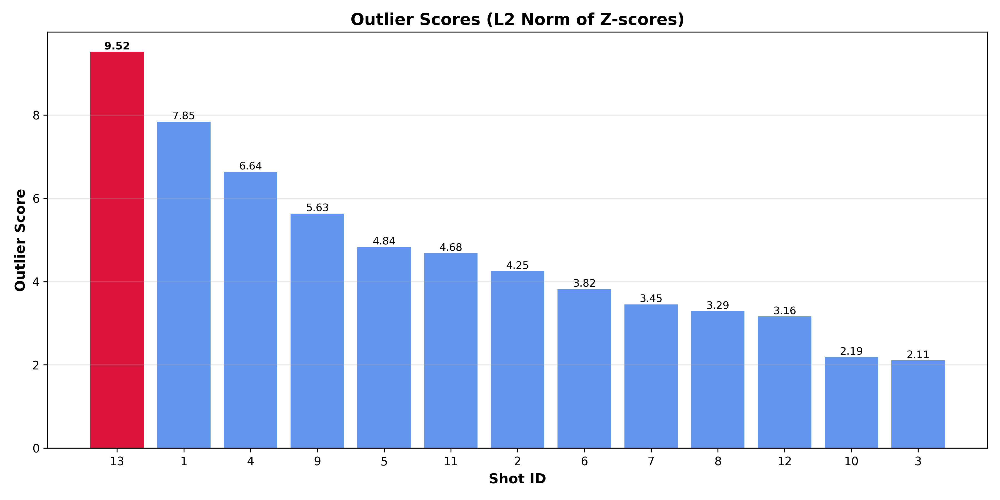
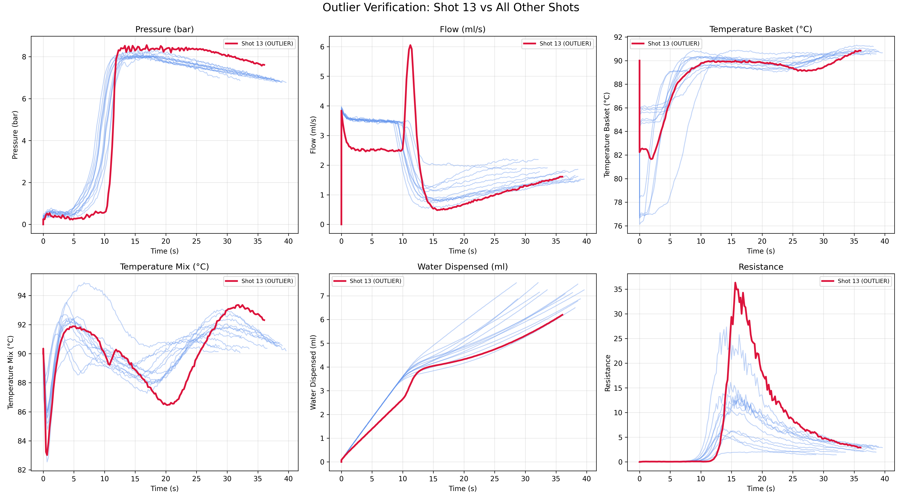

# Coffee Brewing Outlier Detection

**HackResearch 2025 24 Hour Hackathon Submission**
*November 8-9, 2025*
*University of Texas Rio Grande Valley*

> **Update:** This project won HackResearch 2025!

## Team Members
- **Mario Camarena** - Department of Computer Science, UTRGV
  mario.camarena01@utrgv.edu
- **Oziel Sauceda** - Department of Computer Science, UTRGV
  oziel.sauceda01@utrgv.edu
- **Samantha Ocaña** - Department of Computer Science, UTRGV
  samantha.ocana01@utrgv.edu

## Resources
- [Original Problem Statement](reports/problem_statement.pdf)
- [Our Submission Paper](reports/submission_paper.pdf)

## Overview

Espresso brewing is an extremely precise process where factors like temperature, bean age, and humidity significantly impact the final cup quality. This project presents a data-mining approach to identify anomalous espresso shots from brewing logs recorded by a DE1 espresso machine.

In this challenge, we were provided with 13 espresso brewing logs from a DE1 machine, where one shot was brewed using old coffee beans not suitable for sale, while the remaining 12 were from the same fresh batch. The logs were unlabeled, and our task was to identify which shot was the outlier using data mining techniques.

Using temporal alignment, Z-score normalization, and L2-norm distance metrics, we successfully identified **Shot 13** as the outlier. Shot 13 was brewed from an old bag of coffee beans and deviated significantly across multiple parameters.

Each brewing profile contained time-series data including:
- Espresso elapsed time
- Pressure (bar)
- Flow rate (ml/s)
- Temperature (basket and mix, °C)
- Water dispensed (ml)
- Resistance

## Methodology

### 1. Data Preprocessing
- **Temporal Alignment**: Resampled all shots to 200 uniform time points using linear interpolation on `espresso_elapsed` as the time axis
- **Normalization**: Applied Z-score standardization across all shots for each metric to ensure fair comparison across different measurement scales

### 2. Feature Extraction
For each normalized time series, we computed:
- **Mean**: Typical level throughout the shot
- **Maximum**: Peak intensity
- **Sum**: Area under the curve (total magnitude)

This resulted in a 39-dimensional feature vector per shot (13 metrics × 3 statistics).

### 3. Outlier Detection
- Standardized all features using Z-scores
- Computed L2 norm (Euclidean distance) across all standardized features for each shot
- Higher scores indicate shots that deviate most from the group

### 4. Algorithm
```
For each shot:
  1. Resample time series to fixed length
  2. Normalize using Z-score (μ and σ from all shots)
  3. Extract features (mean, max, sum)
  4. Standardize feature vectors
  5. Compute L2 distance: sqrt(Σ(z_i²))
```

## Results

**Identified Outlier: Shot 13**

- **Outlier Score**: 9.5227
- **21.4%** higher than 2nd highest (Shot 1: 7.8459)
- **124.0%** above median (4.2518)
- **2.19 standard deviations** above mean (4.7257)

### Key Physical Deviations in Shot 13:
- Pronounced mid-shot flow spike
- Altered basket and mix temperature trajectories
- Reduced total water dispensed
- Highest and most prolonged resistance peak
- Delayed pressure rise

These patterns are consistent with espresso brewed from aged coffee beans, which exhibit different puck resistance and flow characteristics due to changes in bean structure and volatile compound profiles.

### Visualizations


*Figure 1: All 13 espresso shot profiles across key metrics. Shot 13 shows distinct deviations from the typical brewing pattern.*


*Figure 2: Outlier scores for all shots. Shot 13 (red) has the highest score at 9.5227, significantly higher than all other shots.*


*Figure 3: Outlier verification across all metrics. Shot 13 (red) shows clear deviations from normal shots (blue) in pressure, flow, temperature, and resistance profiles.*

## Installation & Usage

### Prerequisites
```bash
pip install pandas numpy matplotlib
```

### Running the Analysis

```bash
# Run full pipeline (identifies outlier and saves results)
python main.py

# Generate brewing profile visualizations
python plot_profiles.py

# Generate raw data exploration plots
python visualize_raw_data.py
```

### Output Files
- `results/outlier_scores.csv` - Outlier scores for all 13 shots
- `results/outlier_statistics.txt` - Detailed statistical analysis
- `results/*_profiles.png` - Individual metric profile plots
- `results/all_profiles_combined.png` - Combined visualization
- `results/outlier_verification_*.png` - Per-metric outlier comparisons
- `results/outlier_scores_chart.png` - Bar chart of scores

## Project Structure

```
coffee_outlier/
├── data/                          # Espresso shot data files (*.txt)
├── results/                       # Output files and visualizations
├── raw_data_visualizations/       # Data exploration plots
├── data_loader.py                 # Load and parse shot files
├── preprocess.py                  # Temporal alignment and normalization
├── features.py                    # Feature extraction
├── outlier_detection.py           # L2-norm scoring
├── main.py                        # Full pipeline
├── plot_profiles.py               # Profile visualizations
├── visualize_raw_data.py          # Data exploration plots
└── README.md                      # This file
```

## Technical Details

### Why This Approach Works
1. **Unsupervised**: No labeled training data required
2. **Multivariate**: Captures deviations across all brewing parameters
3. **Interpretable**: Physical deviations directly map to score magnitude
4. **Lightweight**: Minimal computational requirements
5. **Robust**: Z-score normalization handles different measurement scales

## Conclusion

This study successfully demonstrated that simple distance-based analysis, combined with proper normalization and feature extraction, can reliably detect brewing inconsistencies in espresso preparation. The pipeline identified Shot 13 with high confidence, and visual inspection confirmed its unique extraction behavior across pressure, flow, and temperature profiles.

The method is practical for real-world café environments, requiring only the sensor data already collected by modern espresso machines like the DE1, without the need for large datasets or complex machine learning models.

## Acknowledgments

**Special thanks to:**
- **Dr. Wylie** for hosting HackResearch 2025 and providing this excellent learning opportunity
- **Dr. Gao** for contributing the coffee brewing outlier problem
- **Dr. Zhang** for contributing the coffee brewing outlier problem

---

*This project was completed during HackResearch 2025, a hackathon hosted at the University of Texas Rio Grande Valley on November 8-9, 2025.*
